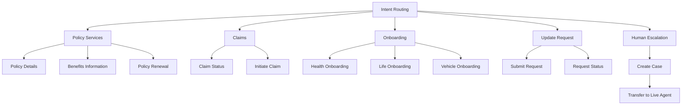

# CX Agent Studio Flows

## Flow List

1. Authentication Flow
2. Intent Routing Flow
3. New User Onboarding Flow
4. Multi-Policy Selection Flow
5. Policy Inquiry Flow
6. Benefits Information Flow
7. Claim Status Flow
8. New Claim Initiation Flow
9. Policy Renewal Flow
10. Customer Update Request Flow
11. Agent Escalation Flow

---

## Design Principle

Authentication is the default entry flow for existing customers. New customers are routed directly to the New User Onboarding Flow.

After successful authentication, the customer is routed to the Intent Routing Flow, where the requested service is identified. If the customer has multiple policies, the Multi-Policy Selection Flow is invoked to determine the relevant policy before proceeding.

Each business capability is implemented as an independent flow to improve modularity, scalability, maintainability, and ease of future enhancements. The agent also supports customer onboarding, product coverage inquiries, customer information update requests, update request status tracking, and seamless escalation to a live agent with full conversation context when required.
