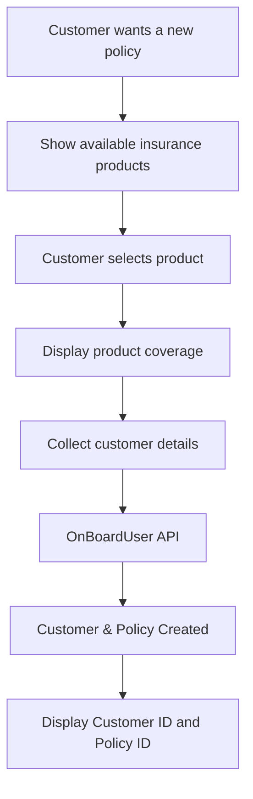
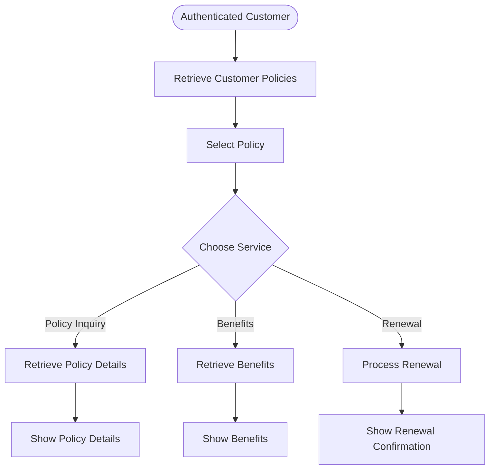
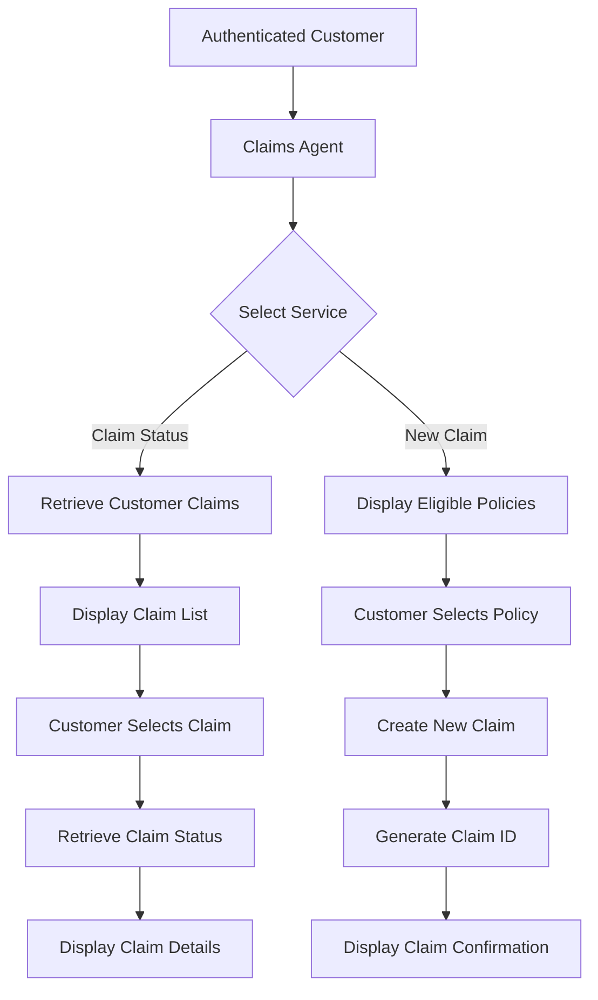
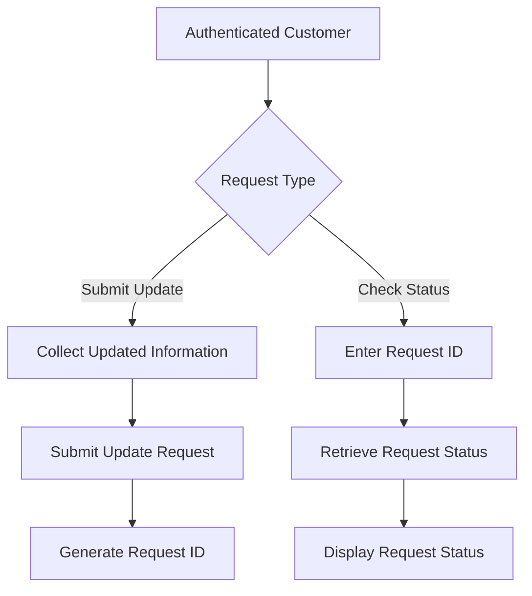
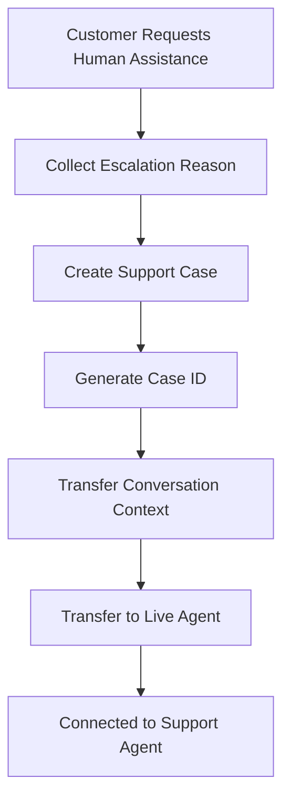

# Conversation Flows

## 1. Customer Onboarding

### Flow Diagram

### Flow Steps

1. Customer requests a new insurance policy.
2. Bot displays available insurance products.
3. Customer selects an insurance product.
4. Bot displays product coverage details.
5. Bot collects customer information.
6. System invokes **OnBoardUser()**.
7. Customer profile and policy are created.
8. Bot shares the Customer ID and Policy ID.

---

# 2. Policy Services

The Policy Services Agent handles:

- Policy Inquiry
- Benefits Information
- Policy Renewal

## Flow Diagram

### Policy Inquiry Flow

1. Customer requests policy details.
2. System verifies authentication.
3. Customer selects a policy.
4. System invokes **getPolicyDetails()**.
5. Bot displays policy information.
6. Bot asks if additional assistance is required.

### Benefits Information Flow

1. Customer requests policy benefits.
2. Customer selects a policy.
3. System invokes **getBenefitsInfo()**.
4. Bot displays benefits and coverage.
5. Bot asks if additional assistance is required.

### Policy Renewal Flow

1. Customer requests policy renewal.
2. Customer selects a policy.
3. System invokes **renewPolicy()**.
4. Renewal is completed successfully.
5. Bot shares the updated validity date.

> **Proactive Renewal:** If a selected policy is approaching expiry, the agent automatically offers renewal before the customer requests it.

---

# 3. Claims

The Claims Agent handles:

- Claim Status
- New Claim Initiation

## Flow Diagram

### Claim Status Flow

1. Customer requests claim status.
2. Customer selects a policy.
3. System retrieves associated claims.
4. Customer selects a claim.
5. System invokes **getClaimsStatus()**.
6. Bot displays claim details.

### New Claim Flow

1. Customer requests to file a claim.
2. Customer selects a policy.
3. System invokes **initiateClaim()**.
4. Claim is created successfully.
5. Bot displays the generated Claim ID.

---

# 4. Update Requests

The Update Request Agent handles:

- Submit Update Request
- Check Update Request Status

## Flow Diagram

### Submit Update Request Flow

1. Customer requests to update personal information.
2. Bot collects the updated information.
3. System invokes **RequestUpdate()**.
4. Update request is created.
5. Bot displays the generated Request ID.

### Update Request Status Flow

1. Customer requests the status of an update request.
2. Customer provides the Request ID.
3. System invokes **getRequestStatus()**.
4. Bot displays the latest request status.

---

# 5. Human Escalation

## Flow Diagram

### Flow Steps

1. Customer requests human assistance.
2. Bot collects the escalation reason.
3. System invokes **createCase()**.
4. Support Case is generated.
5. Conversation context is prepared.
6. System invokes **escalateToAgent()**.
7. Customer is transferred to a live support agent.
8. Bot shares the generated ticket number.

---
