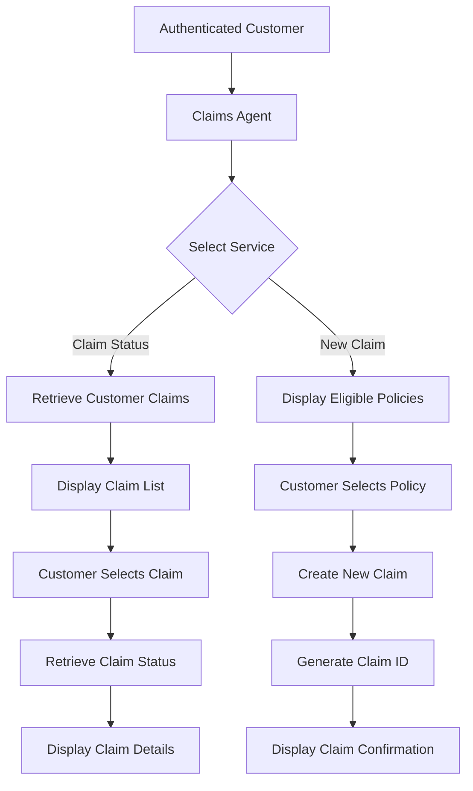

```mermaid
flowchart TD

A[Authenticated Customer]
A --> B[Claims Agent]

B --> C{Select Service}

C -->|Claim Status| D[Retrieve Customer Claims]
D --> E[Display Claim List]
E --> F[Customer Selects Claim]
F --> G[Retrieve Claim Status]
G --> H[Display Claim Details]

C -->|New Claim| I[Display Eligible Policies]
I --> J[Customer Selects Policy]
J --> K[Create New Claim]
K --> L[Generate Claim ID]
L --> M[Display Claim Confirmation]
```
